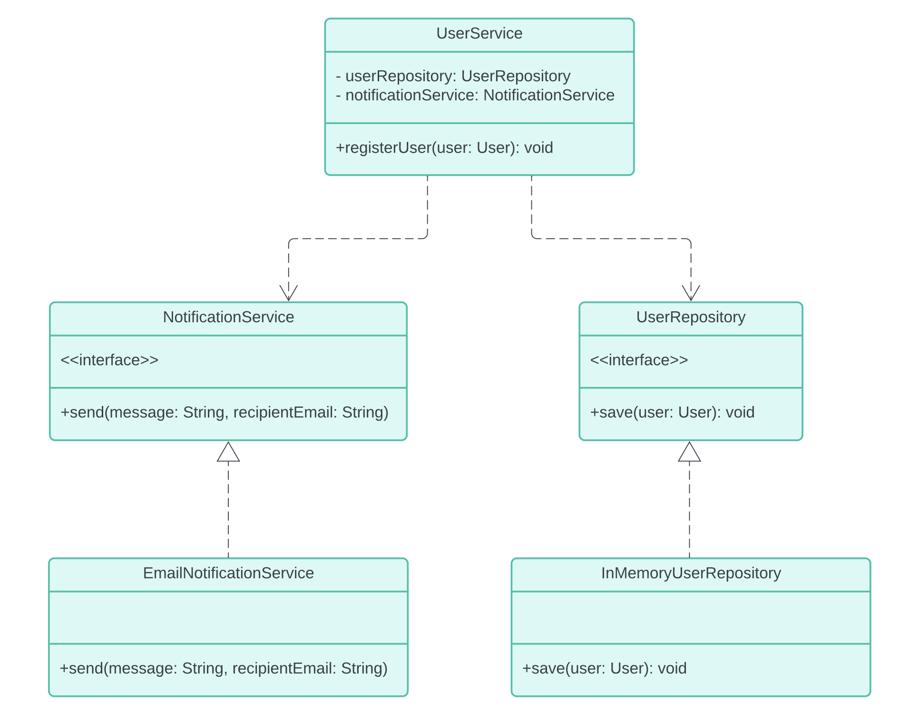

#  Implementing a User Registration Service

In this exercise, you will design and implement a User Registration Service that allows
users to register by providing their name, email, and password. The system will save the
user in a repository and simulate sending a notification to the user after registration. The
mail server settings (such as host and port) for sending notifications should be
configurable via the application.properties file. This is a simulation, and no actual emails
will be sent.

## Class Diagram

### Steps
1. <b>Define the User class:</b>  
   • Attributes:  
   • id (Long)  
   • email (String)  
   • password (String)  
   • name (String)  
2. <b>Implement the UserRepository interface:</b>  
   • Define the UserRepository interface with a single method  
   • save(User user): void  
   • Implement the UserRepository interface in a class called  
   InMemoryUserRepository. Use a HashMap to store users in memory, with the
   email address as the key and the User object as the value.
3. <b>Implement the NotificationService interface: </b>
   • Define a NotificationService with a method:  
   • send(String message, String recipientEmail): void  
   • Create an EmailNotificationService that implements this interface and
   simulates sending an email by printing to the console.  
   • The mail server settings (such as host and port) should be read from the
   application.properties file and printed as part of the simulated email sending
   process.  
4. <b>Design the UserService class:</b>  
   • The UserService should:  
   • Register a new user using the UserRepository.  
   • Send a confirmation notification using the NotificationService.  
   • Ensure that UserService can work with any implementation of
   NotificationService, making the notification method easily replaceable.  
5. <b>Test the registration system:</b>  
   • In your main method, create an instance of UserService and call the
   registerUser() method.  
   • Verify that the user is saved and a confirmation message is printed to the
   console simulating an email notification.  
6. Bonus step: Handle duplicate user registration.